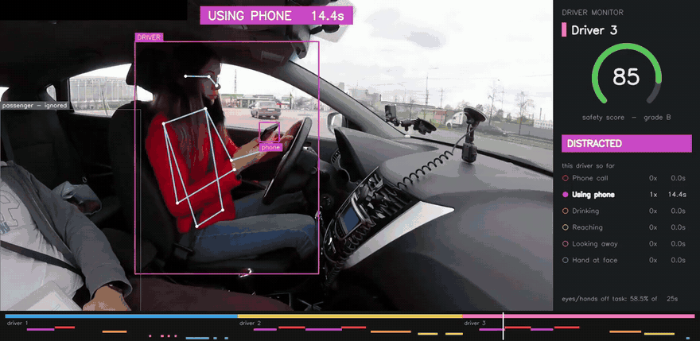
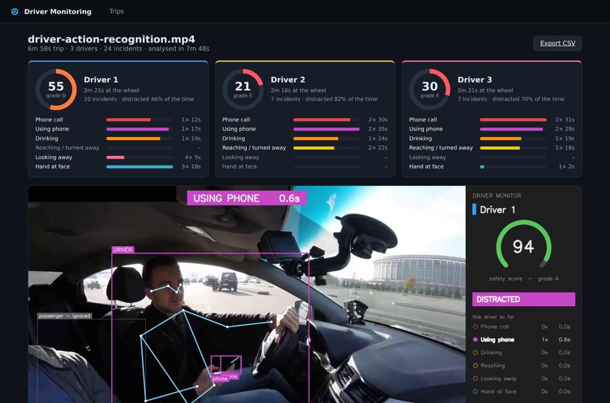
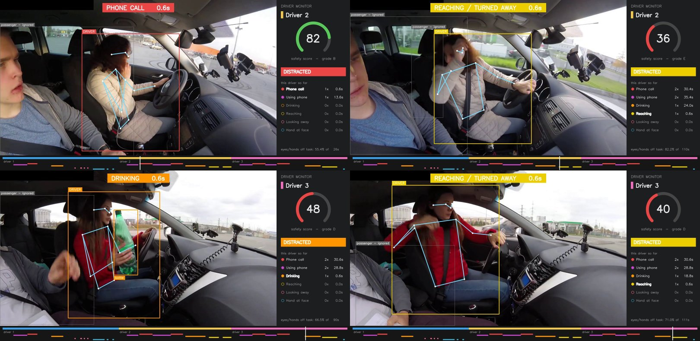

# Driver Monitoring

Cabin camera footage in, driver safety report out.

Fleet operators (trucking, delivery, taxi, bus) put a camera on the dashboard facing the driver. Nobody has time to watch hours of that footage. This tool watches it for them: it finds the driver, ignores the passenger, detects phone use, calls, drinking, looking away, reaching into the back seat and hands on the face, works out when a different person takes the wheel, and gives each driver a safety score with a clip of every incident.



https://github.com/user-attachments/assets/f1fd6ec2-9292-429c-8e35-7b062594ca9f

It runs on a laptop CPU, no GPU needed, and comes with a small web dashboard.



## What it detects

| Behaviour | How |
|---|---|
| **Phone call** | phone at the driver's head, or a hand kept at the ear right after the phone was clearly seen there (the hand usually hides it) |
| **Using phone** | the driver's phone out, in the hand or on the lap |
| **Drinking** | bottle or cup in the hand or at the mouth |
| **Reaching / turned away** | body turned round towards the back seat, arm stretched towards the passenger side, or the body moved well away from its usual position in the seat |
| **Looking away** | head turned away from the road (towards the passenger or the back) for about a second or more |
| **Hand at face** | hand at the face or on the head, with no phone or drink involved |

Plus, for each trip:

- **Driver changes.** The camera cuts are found automatically and each segment is matched to a driver by the colours of their clothing, so a trip with three drivers gets three scorecards.
- **Passengers are ignored.** The driver is the person in the driver's seat (right side of the image by default, `--driver-side left` for the other layout). A passenger playing with their phone does not count against the driver, even when the phone overlaps the driver in the picture: an object belongs to whoever's hand is closest to it.
- **Mounted phones are ignored.** A phone on the windscreen holder sits in the same place all the time and is never in the driver's hand, so it's treated as part of the car.



## Results

Tested on [driver-action-recognition.mp4](https://github.com/intel-iot-devkit/sample-videos) (7 minutes, 1080p, three drivers). I labelled every behaviour by hand, second by second, with start and end times (`labels/driver-action-recognition.json`), and scored the output against it with `scripts/evaluate.py`.

A detected incident counts as correct if it overlaps a labelled one of the same type by at least 30%.

| Behaviour | Labelled | Detected | Found | Correct | Time covered |
|---|---:|---:|---:|---:|---:|
| Phone call | 5 | 5 | 5 / 5 | 5 / 5 | 97% |
| Using phone | 5 | 5 | 5 / 5 | 5 / 5 | 95% |
| Drinking | 3 | 3 | 3 / 3 | 3 / 3 | 97% |
| Reaching / turned away | 4 | 3 | 3 / 4 | 3 / 3 | 92% |
| Looking away | 6 | 4 | 4 / 6 | 4 / 4 | 38% |
| Hand at face | 3 | 4 | 3 / 3 | 4 / 4 | 54% |
| **All** | **26** | **24** | **23 / 26 (88%)** | **24 / 24 (100%)** | |

- Driver changes: all three drivers found, changeovers placed within 0.3 s of the real cut.
- Per 0.2 s slice, when the system says the driver is distracted it's right 95% of the time. It catches 84% of the distracted time.

Where it goes wrong, and why:

- **Using the radio isn't detected** (17 s of driver 3). From the side, a hand on the radio looks exactly like a hand resting on the gear lever, which driver 1 does for 15 s without being distracted. Telling them apart needs either a zone drawn around the console for each car, or gaze tracking.
- **Looking down isn't caught, and one sideways glance is missed.** Turning the head sideways flips which side of the face the camera sees, which is easy to measure; looking straight down at the lap barely changes the side view. That's the 3 s where driver 1 looks at his lap, and it's why "looking away" covers only 38% of the labelled time even though the four head turns it reports are all real. A 3 s reach down to the seat for a bottle is missed too.
- **Hand at face is found every time but only for half its duration.** When the hand is on top of the head the wrist is hidden behind it and the pose model loses it.
- The rules were developed on this same video, so there's no held-out test set. Treat these numbers as a sanity check, not a benchmark.

Speed on a 2-core laptop CPU: detection runs at about 2 analysed frames per second (5 frames analysed per second of video), so a 7 minute trip takes about 16 minutes. Rendering the annotated video at the full 30 fps takes another 8; skip it with `--no-video` if you only need the report.

## How it works

```
video ──► people + 17 body keypoints (YOLO11n-pose, ByteTrack)  ─┐
      ──► phones, bottles, cups (YOLO11s)                        ├─► per-frame observations (cacheable JSON)
      ──► camera cut detection (colour histograms)              ─┘
                                   │
                                   ▼
        find the driver ─► drop fixtures ─► pose features ─► per-frame flags ─► smoothing ─► events
                                   │
                                   ▼
        clothing signature per shot ─► driver 1, 2, 3 ─► scorecards ─► report, CSV, clips, annotated video
```

A few details that made a difference:

- **Body units.** All distances are divided by a fifth of the driver's usual height in that shot. Shoulder width looked like the obvious choice but collapses when the driver turns sideways, which made every "is the hand near the phone" check fail exactly when it mattered.
- **Seat baseline.** Leaning is measured against where this driver usually sits in this shot (median torso position), not against a fixed spot in the image.
- **Hidden objects.** Object detectors lose a phone the moment a hand covers it. So a hand held to the ear right after the phone was clearly seen (at least 5 confident sightings in 8 s) is still a call, and it stays a call for as long as the hand doesn't leave the ear. "Held to the ear" means the wrist is below the ear, the way you hold a phone; a hand resting on top of the head is hand at face, not a call. When the hand holding the phone disappears behind the head, the pose model sometimes puts both arms on the one it can see; that doesn't end a call that's already going. The same goes for drinks.
- **Whose object is it.** An object counts only if the driver's hand is the closest one to it and it isn't inside another person's body. In the sample, the passenger holds his phone in the foreground, right across the driver.
- **Head direction.** From the side, the nose is normally on one side of the visible ear. When the driver turns their head towards the passenger or the back, the camera suddenly sees the other side of the face and the nose ends up on the other side of the ear. Glances are short, so this one uses a lighter smoothing (0.6 s) and a 0.8 s minimum instead of 1.5 s; a single-frame flick is still ignored.
- **Turning round.** A camera at the side sees the driver in profile. When they twist towards the back seat their shoulders suddenly look much wider, which is a steadier signal than the head keypoints.
- **Things that belong to the car.** An object that sits in the same place for half a shot, or keeps turning up in the same spot over 30 s, and is rarely in the driver's hand, is part of the car: the windscreen phone mount, or the gear stick that the detector sometimes calls a bottle.
- **Filtering false detections.** A "phone" bigger than any real phone at that distance is a false detection (measured on this video: real phones are under 0.9 body units, false ones cluster around 1.3). A bottle only counts once it's picked up.
- **Smoothing.** Flags are majority-voted over a 1.2 s window. Incidents shorter than 1.5 s are dropped, gaps under 2 s are bridged (3 s for phone use), and nothing spans a camera cut. A bottle at the mouth is mostly hidden by the hand, so the detector only catches it about once a second: between two sightings up to 6 s apart the driver is treated as still drinking. When two incidents overlap, the more specific one wins (a call beats hand at face).

### Scoring

Every incident costs points: a fixed amount plus an amount per second. Score = 100 − points, graded A (90+) to E (below 40).

| Behaviour | Per incident | Per second |
|---|---:|---:|
| Using phone | 6 | 0.6 |
| Phone call | 4 | 0.4 |
| Reaching / turned away | 4 | 0.5 |
| Drinking | 2 | 0.2 |
| Looking away | 2 | 0.5 |
| Hand at face | 1 | 0.1 |

Handheld phone use weighs the most since it's the distraction most linked to crashes. The weights are a judgement call and live in one table in `dms/scoring.py`.

## Running it

Python 3.10+.

```bash
git clone https://github.com/Zeeshan409-coder/driver-monitoring-system.git
cd driver-monitoring-system
python -m venv .venv && source .venv/bin/activate   # Windows: .venv\Scripts\activate
pip install -r requirements.txt
python scripts/download_samples.py
```

Or just `run.bat` / `./run.sh`, which does all of the above and starts the dashboard.

**Dashboard**

```bash
uvicorn server.app:app --port 8000
```

Open http://localhost:8000, pick the sample or upload your own video, hit Analyse. Runs are queued and processed one at a time in the background; reports stay in `data/runs/` across restarts. Click the timeline or any incident to jump to it in the video.

**Command line**

```bash
python -m dms analyze samples/driver-action-recognition.mp4 --out runs/trip
```

```
  driver 1: score 55 (D), 10 events, distracted 46.3% of 141s  [using phone x1, phone call x1, drinking x1, looking away x4, hand at face x3]
  driver 2: score 21 (E), 7 events, distracted 81.9% of 136s  [using phone x2, phone call x2, drinking x1, reaching / turned away x2]
  driver 3: score 30 (E), 7 events, distracted 69.6% of 141s  [using phone x2, phone call x2, drinking x1, reaching / turned away x1, hand at face x1]
```

Output in `runs/trip/`:

- `annotated.mp4`: the video at normal speed and full frame rate, with the live panel and timeline
- `report.json`: everything (drivers, scorecards, incidents, driver spans)
- `events.csv`: one row per incident
- `clips/`: one short clip per incident
- `snapshots/`: one frame per incident

Options: `--fps` (frames analysed per second, default 5), `--driver-side left|right`, `--pose-model`, `--object-model`, `--no-video` (report only).

Detection is the slow part, so you can cache it and re-run the rules in seconds:

```bash
python scripts/extract.py samples/driver-action-recognition.mp4 --out runs/trip.obs.json
python -m dms analyze samples/driver-action-recognition.mp4 --cache runs/trip.obs.json --no-video
python scripts/evaluate.py runs/trip/report.json labels/driver-action-recognition.json
```

**Tests**

```bash
pip install -r requirements-dev.txt
pytest -q
```

The tests (61 of them) build synthetic detections, so they don't need the models or a GPU and run in about a second. They cover the behaviour rules, fixtures, driver selection, smoothing, scoring, driver identity, the evaluation script and the API.

## Project layout

```
dms/
  perception.py   YOLO pose + object detection
  shots.py        camera cut detection
  behaviour.py    driver selection, fixtures, per-frame rules, smoothing into events
  identity.py     clothing signature per shot -> driver number
  scoring.py      scorecards
  render.py       annotated video: overlays, live panel, trip timeline
  pipeline.py     ties it together, writes report/CSV/clips
  cli.py
server/           FastAPI app, background job queue, dashboard (plain JS, no build step)
scripts/          download samples, cache detections, evaluate against labels
labels/           hand-made ground truth for the sample video
tests/
```

## Limitations

- Clothing is not identity. Two drivers dressed alike would be merged, and one driver changing jackets would be split. Face recognition is the proper fix for a real fleet.
- Using the radio or the centre console isn't detected (see Results).
- Eyes aren't tracked, only which way the head points. Looking down, looking at a phone on the mount and drowsiness need a face/gaze model, and a camera closer to the driver's face than this one.
- The sample is daytime footage. Night driving needs an IR camera, and the models would need testing on IR images.
- 5 analysed frames per second catches glances of about a second or longer, not quicker ones.

## Credits

- Sample video: [Intel IoT DevKit sample videos](https://github.com/intel-iot-devkit/sample-videos), licensed [CC BY 4.0](https://creativecommons.org/licenses/by/4.0/).
- Detection and pose models: [Ultralytics YOLO11](https://github.com/ultralytics/ultralytics) (AGPL-3.0).

## License

AGPL-3.0, since it builds on Ultralytics. See [LICENSE](LICENSE).
